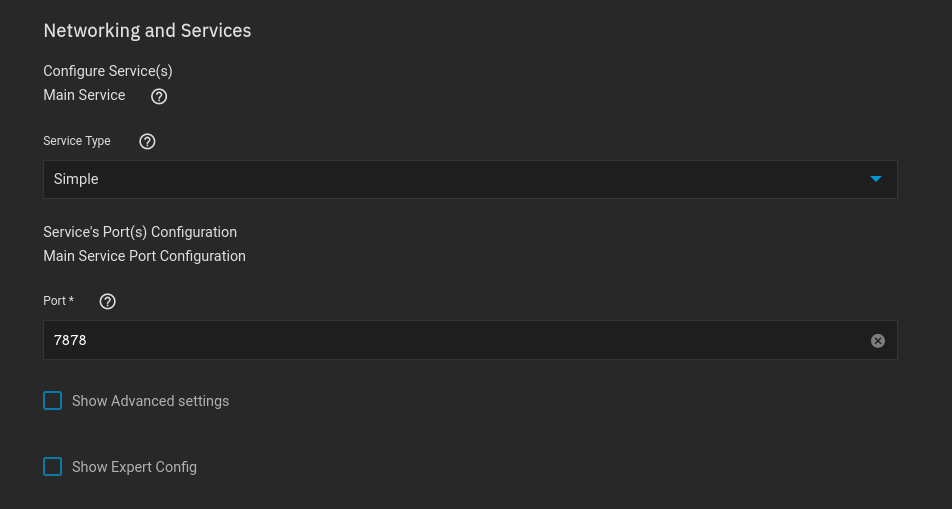
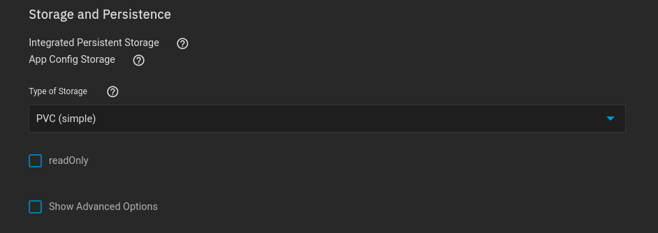
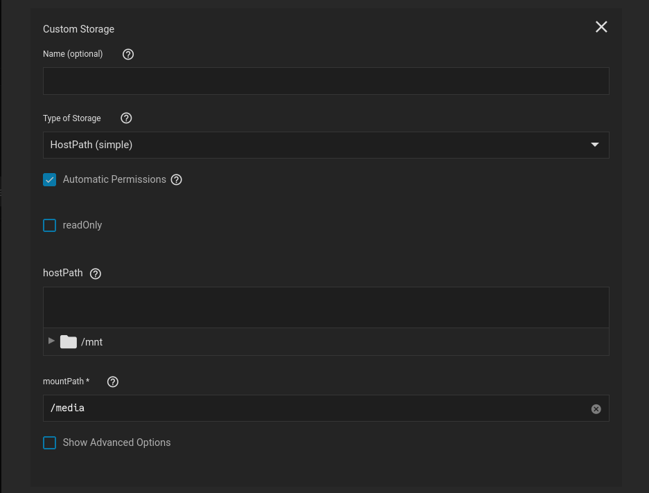
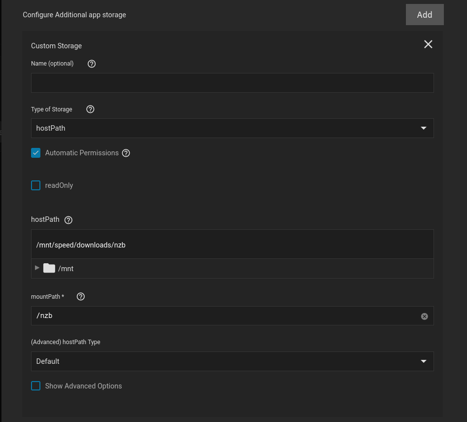
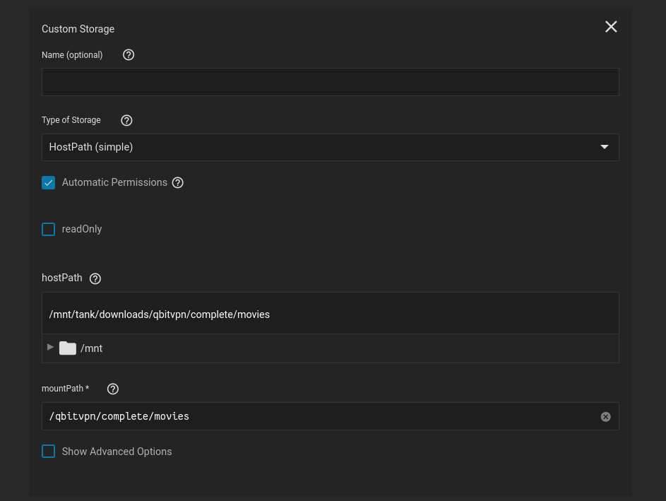
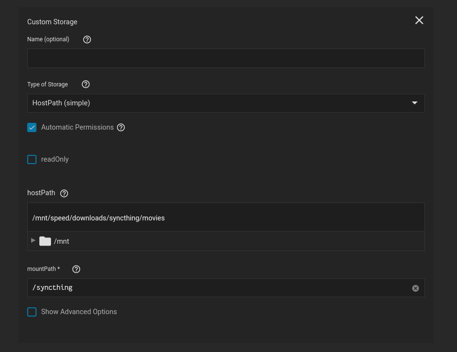
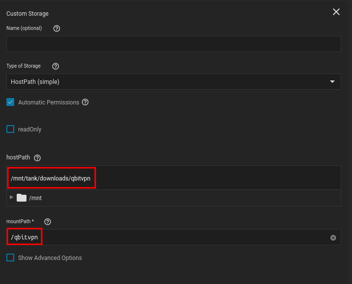
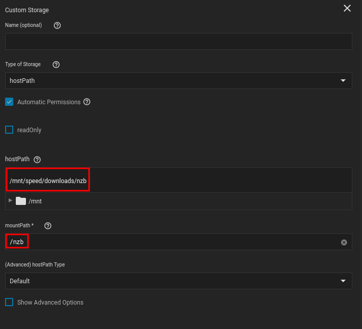
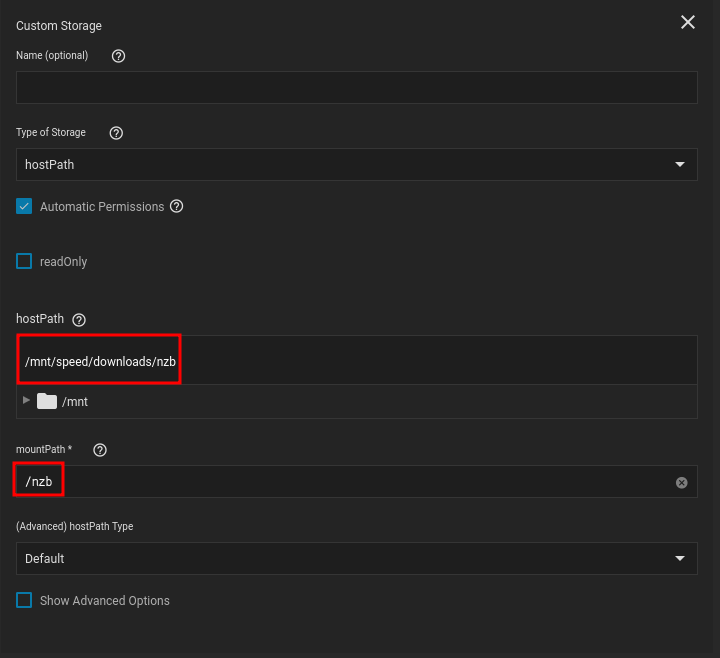
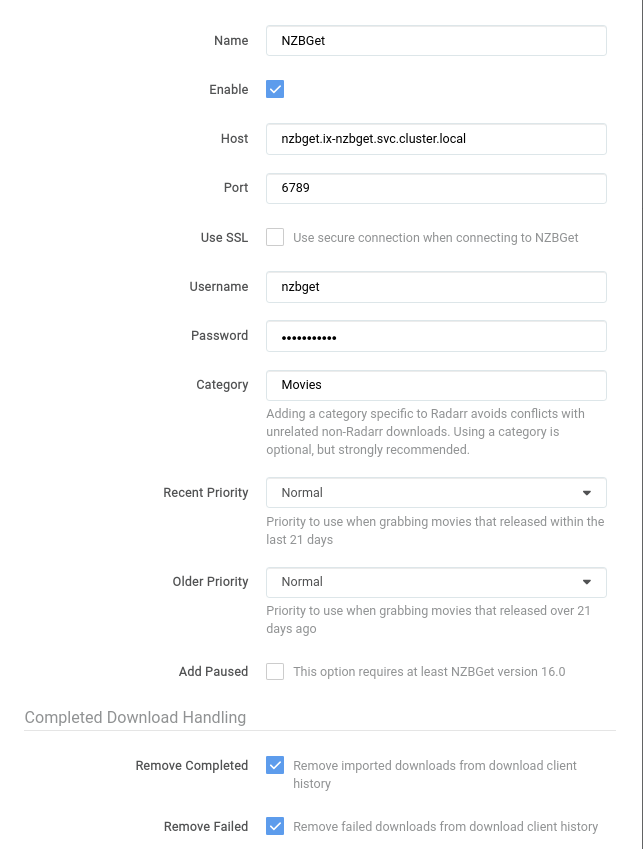

## App Installation

### Networking

If you are wanting to use ingress, its probably better to use clusterIP instead

- We changed the UDP and TCP port to match the Mullvad ports allocated, your VPN provider might require something else

 

### Storage

#### Configuration

The setup is default

 

#### Media - Destination Folders

- Media is so that Radarr will have a location to place files once they're completed
- This will be the folder Radarr places files for plex to then parse through.

 

#### Backups

- '/config/Backups' is the location Radarr places its automatic and manual backups
- We created a separate dataset meant for backups, specifically to have an easy way to restore a backup, in the event the application is wrongly deleted, or removed, corrupt, whatever

 

#### NZB

- This is obviously the location Radarr will look for completed NZB files
- Its also the location NZBGet saves its completed movie files

 

#### Bittorrent

- This is the location Radarr will look for completed qBittorrent files
- Its also the location qBittorrent saves its completed movie files

 

#### Syncthing

- This is the location Radarr will look for completed Syncthing files
- Its also the location Syncthing saves its completed movie files

 

## In-App Configuration

For Radarr, We specifically just follow the [TRaSH Guides for Radarr](https://trash-guides.info/Radarr/) setup.

- It clearly details how to setup custom profiles to ensure you are grabbing the latest and greatest media. We have been using it for months now and have not had an issue.

 

Thank Goodness for IBRACORP, We thought We would have to make a video myself covering this topic. However, it seems they got most of everything We would have covered.

## qbittorrent Integration

### Mountpoints

Its important to keep your mountpoints for each of the applications the same. Otherwise you will need to setup a `remote path`

- They may be slightly different, but as long as they have the same root directory it will be fine.

 

#### Radarrs Storage Settings

I set it to a sub directory of `/qbitvpn` though since `/qbitvpn/complete/movies` is the only directory Radarr needs to see, since it only needs to see movies that are completed

#### qBittorrents Storage Settings

 

### Linking Radarr to qBittorrent

#### Explanation

:::tip[Radarr "Explanation"]

| Name             | Value                                            | Reason                                                                                                                                                                                       |
| ---------------- | ------------------------------------------------ | -------------------------------------------------------------------------------------------------------------------------------------------------------------------------------------------- |
| Name             | qbitvpn                                          | Doesn't matter what you call it, just call it something memorable                                                                                                                            |
| Host             | qbitvpn-qbittorrent.ix-qbitvpn.svc.cluster.local | You will need to generate a different DNS name if your app name is not `qbitvpn` Generate a new name with [Truecharts Guide](/platforms/scale/guides/linking-apps/)                          |
| Port             | 10095                                            | This is the default port, but if you changed it then its [the first port listed under networking for qbittorrent](https://heavysetup.info/applications/qbittorrent/installation/#networking) |
| Username         | NULL                                             | You can leave this empty if you followed [WEBGUI guide](https://heavysetup.info/applications/qbittorrent/in-app/#webgui)                                                                     |
| Password         | NULL                                             | You can leave this empty if you followed [WEBGUI guide](https://heavysetup.info/applications/qbittorrent/in-app/#webgui)                                                                     |
| Category         | movies                                           | We want my completed torrents to be moved to a folder in `completed/movies` once their done                                                                                                  |
| Remove Completed | False                                            | We do not want to delete my torrents before their done seeding                                                                                                                               |

 

## NZBGet Integration

### Mountpoints

Its important to keep your mountpoints for each of the applications the same. Otherwise you will need to setup a `remote path`

- They may be slightly different, but as long as they have the same root directory it will be fine.

 

#### Radarrs Storage Settings

#### NZBGet Storage Settings

 

### Linking Radarr to NZBGet

#### Explanation

:::tip[Radarr "Explanation"]

| Name             | Value                              | Reason                                                                                                                                                                            |
| ---------------- | ---------------------------------- | --------------------------------------------------------------------------------------------------------------------------------------------------------------------------------- |
| Name             | NZBGet                             | Doesn't matter what you call it, just call it something memorable                                                                                                                 |
| Host             | nzbget.ix-nzbget.svc.cluster.local | You will need to generate a different DNS name if your app name is not `nzbget` Generate a new name with [Truecharts Guide](/platforms/scale/guides/linking-apps/)                |
| Port             | 6789                               | This is the default port, but if you changed it then its [the only port listed under networking for NZBGet](https://heavysetup.info/applications/nzbget/installation/#networking) |
| Username         | nzbget                             | Default is `nzbget` but its under your security settings in nzbget                                                                                                                |
| Password         | NULL                               | This is whatever you set during the [NZBGet in app security](https://heavysetup.info/applications/nzbget/in-app/#security) setup                                                  |
| Category         | Movies                             | We want my completed nzbs to be moved to a folder in `completed/Movies` once their done                                                                                           |
| Remove Completed | True                               | You can't seed nzbs, so there's no point in keeping them                                                                                                                          |
| Remove Failed    | True                               | No reason to keep failed articles                                                                                                                                                 |

 
