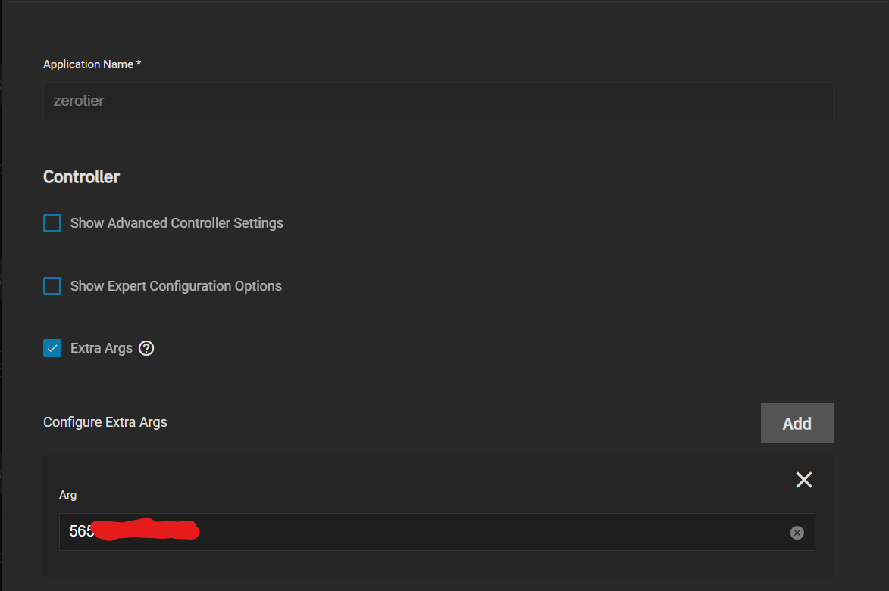

This is a quick how-to or setup-guide to use Zerotier using on your TrueNAS box.
This can be applied to other systems but this specific guide is SCALE specific with the prerequisites.

## Requirements

- Zerotier Account (Free accounts available at [Zerotier's Official website](https://www.zerotier.com))
- Zerotier Truecharts Chart

## Prerequisites (LAN access only)

For proper access to your local network (LAN), this chart requires two `sysctl` values set on your TrueNAS or system.
For TrueNAS SCALE the way to change these values are inside `System Settings` then `Advanced`.
On that screen you add the following two values:

- `net.ipv4.ip_forward`
- `net.ipv4.conf.all.src_valid_mark`

Set them to `1` and `Enabled`

Also prepare your Zerotier Network ID for your setup, easy to create and copy at [https://my.zerotier.com](https://my.zerotier.com)

## Zerotier Chart Setup

Ideally name your chart `Zerotier` but you can use any name here and leave defaults for Step 2

### Global Pod Options

This section is hidden by default for TrueNAS SCALE but if you wish to use `Host-Networking` or create an interface inside TrueNAS SCALE (`zerotier creates a network interface`)

- Click `Expert - Pod Options`
- Click the checkbox for `Host-Networking` if it isn't enabled

### App Configuration

- `ZEROTIER_API_SECRET`: Replaces the authtoken.secret before booting and allows you to manage the control socket's authentication key
- `ZEROTIER_IDENTITY_PUBLIC`: The identity.public file for zerotier-one. Use zerotier-idtool to generate one of these for you.
- `ZEROTIER_IDENTITY_SECRET`: The identity.secret file for zerotier-one. Use zerotier-idtool to generate one of these for you.

### Extra Args

If you wish to automatically join a specific Zerotier Network upon startup simply enter the `Network-ID` in this space.
**Note** This is not required for the chart to run and may not always work.

### Networking and Services

- The default ports are fine for this chart, you shouldn't need to port forward or open ports on your router.

## Support

- You can also reach us using [Discord](/s/discord) for real-time feedback and support
- If you found a bug in our chart, open a Github [issue](https://github.com/truecharts/apps/issues/new/choose)

---

All Rights Reserved - The TrueCharts Project
