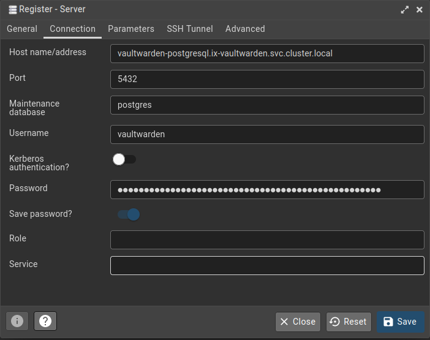
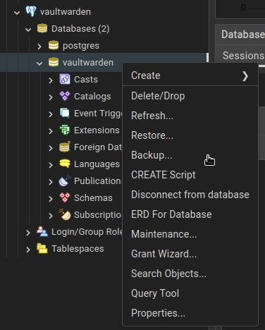
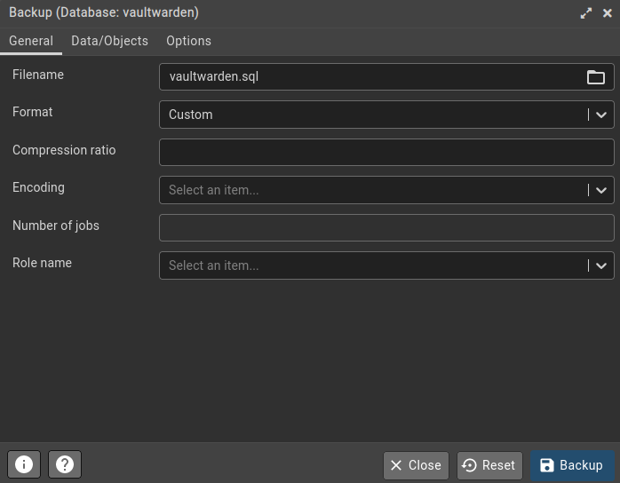
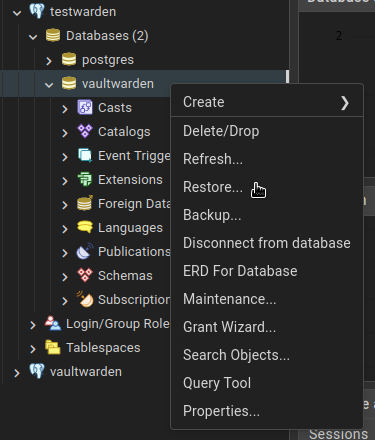
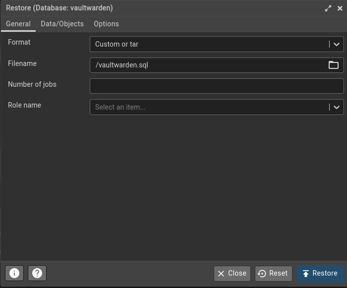
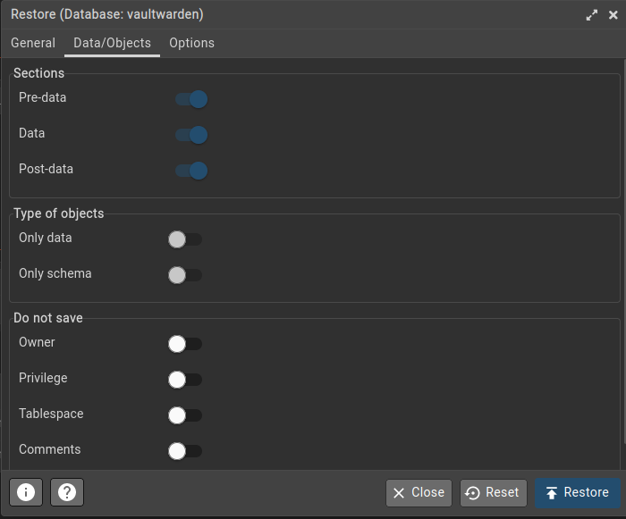
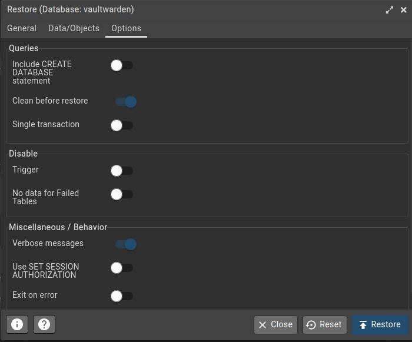
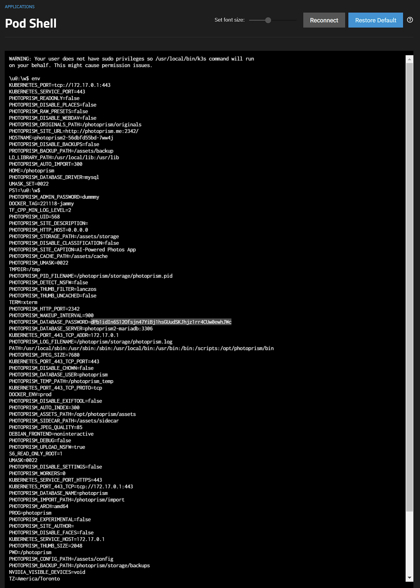
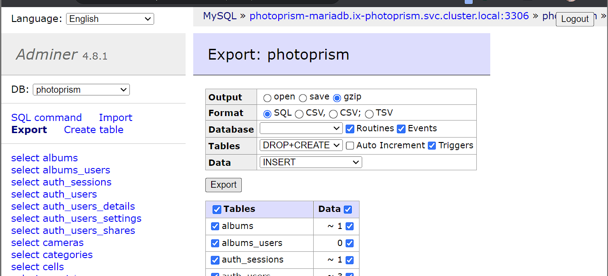

# App Migration Guide

## Goal

A safe migration of an existing app to a new app, while still having the old app available. So if something goes wrong, you haven't lost the old app.

## Create new app with a different name

In this guide, I'll be using the app `vaultwarden` as an example. I chose the name `testwarden` for the new app install.

I installed the new app with mostly default settings, just changed service type to `ClusterIP` and setup a new, temporary, ingress.

## Scale down both apps

We need to run the following commands in the host shell. Everything between `<>` needs to be replaced with the actual value.

First, we need to get the names of the deploys.

```bash
k3s kubectl get deploy -n ix-<old-app>
k3s kubectl get deploy -n ix-<new-app>
```

Example:

```bash
root@truenasvm[/mnt/tank/apps]# k3s kubectl get deploy -n ix-vaultwarden
NAME          READY   UP-TO-DATE   AVAILABLE   AGE
vaultwarden   1/1     1            1           3h21m
root@truenasvm[/mnt/tank/apps]# k3s kubectl get deploy -n ix-testwarden
NAME                                  READY   UP-TO-DATE   AVAILABLE   AGE
testwarden-vaultwarden-cnpg-main-rw   2/2     2            2           3h12m
testwarden-vaultwarden                1/1     1            1           3h12m
```

Here we find the names of the deploys we want to scale down. For apps installed with the default name, it will just be that name.

For apps installed with a different name, it will be `<app-name>-<default-name>`.

So for `vaultwarden` (the default name), it will be `vaultwarden`. But for the vaultwarden app that was installed with the name `testwarden`, it will be `testwarden-vaultwarden`.

:::caution Replace the names in the angle brackets before executing commands

```bash
k3s kubectl scale deploy <app-name>-<default-name> -n ix-<app-name> --replicas=0
k3s kubectl scale deploy <app-name> -n ix-<app-name> --replicas=0
```

:::

:::caution Example commands for apps with name vaultwarden and testwarden

```bash
k3s kubectl scale deploy testwarden-vaultwarden -n ix-testwarden --replicas=0
k3s kubectl scale deploy vaultwarden -n ix-vaultwarden --replicas=0
```

:::

## Postgresql databases

:::info

You can skip this section if the app in question doesn't have a Postgresql database

:::

If the app uses a Postgresql database, we need to make a backup and restore that backup to the new app's database. To access the database, the app must be running.

:::note Requirements

Make sure you have `pgAdmin` installed, as we'll be using it to make a backup and to restore the database. It's a TrueCharts app from the stable train. You can install it with all default settings, and it will work.

Also make sure you have the database info script (`tcdbinfo.sh`) available on your server. Check the [Postgres DB info and restore](https://truecharts.org/manual/SCALE/guides/sql-export) for these files.

:::

### Configure database connections in pgAdmin

run the tcdbinfo.sh script to see the connection details for both the old and the new database, and set them up in pgAdmin.




### Create database Backup

In `pgAdmin`, right click `vaultwarden->Databases->vaultwarden` and click `Backup...`. Give the file a name (e.g. `vaultwarden.sql`) and click `Backup`.




### Restore database backup

In `pgAdmin`, right click `testwarden->Databases->vaultwarden` and click `Restore...`. Select the sql file (`vaultwarden.sql`).




On the 2nd tab page, select the first 3 options (`Pre-data`, `Data` and `Post-data`). On the last tab, select `Clean before restore`. Now click `Restore`.




## MariaDB Databases

<details>
  <summary>MariaDB Database Migration</summary>
  <div>
    <div>View MariaDB export and import instructions</div>
    <br/>
If the app uses a MariaDB database, we need to make a backup and restore that backup to the new app's database.

:::note Requirements

Make sure you have `adminer` installed, as we'll be using it to make a backup and to restore the database. It's a TrueCharts app from the stable train. You can install it with all default settings, and it will work.

:::

### Configure database connections in adminer

To get the MariaDB credentials from each install the easiest way (until a script does this) is logging into the main container shell and typing `env`, which pulls down the list of `environment variables` used by the container, including the `database credentials`.


Repeat the same for the "new" app



### Create database Backup

Login to `adminer` using the 4 values highlighted in red above. For most users it'll be `appname-mariadb.ix-appname.svc.cluster.local:3306` or in this case `photoprism-mariadb.ix-photoprism.svc.cluster.local:3306`


Click `Export`, choose a compression output (gzip) and press `export`



### Restore database backup

Now you login to `adminer` with the "new" app


Click `Import`, then `Choose Files`, upload your backup and then click `Execute`


  </div>
</details>

## Migrate the PVCs

### Get the PVCs names and paths

The following commands will return the PVCs for the old and the new install.

```bash
k3s kubectl get pvc -n ix-vaultwarden
k3s kubectl get pvc -n ix-testwarden
```

Take note of all the PVCs that do not contain `postgres`, `redis` or `cnpg`. `vaultwarden` only has 1 data PVC. There are apps that have more than 1. You'll want to migrate them all.

Now, find the full paths to all these PVCs.

```bash
zfs list | grep pvc | grep legacy
```

If this returns a very long list, you can add `| grep <app-name>` to filter for only the PVCs of the app you're currently working on.

A full PVC path looks something like this: `poolname/ix-applications/releases/app-name/volumes/pvc-32341f93-0647-4bf9-aab1-e09b3ebbd2b3`.

### Destroy new PVC and copy over old PVC

Destroy the PVCs of the new app and replicate the PVC of the old app to the new location.

:::danger

Make sure you're not mixing up the old app and the new app here. Destroy the _NEW_ PVC. The old PVC contains your data.

:::

```bash
zfs destroy new-pvc
zfs snapshot old-pvc@migrate
zfs send old-pvc@migrate | zfs recv new-pvc@migrate
zfs set mountpoint=legacy new-pvc
```

The `new-pvc` will look something like `poolname/ix-applications/releases/testwarden/volumes/pvc-32341f93-0647-4bf9-aab1-e09b3ebbd2b3`.

The `old-pvc` will look something like `poolname/ix-applications/releases/vaultwarden/volumes/pvc-40275e0e-5f99-4052-96f1-63e26be01236`.

Example of all commands in one go:

```bash
root@truenasvm[~]# k3s kubectl get pvc -n ix-vaultwarden
NAME                          STATUS   VOLUME                                     CAPACITY   ACCESS MODES   STORAGECLASS                   AGE
vaultwarden-data              Bound    pvc-33646e70-ccaa-464c-b315-64b24fcd9e83   256Gi      RWO            ix-storage-class-vaultwarden   4h27m
db-vaultwarden-postgresql-0   Bound    pvc-5b3aa878-0b76-4022-8542-b82cd3fdcf71   999Gi      RWO            ix-storage-class-vaultwarden   4h27m
root@truenasvm[~]# k3s kubectl get pvc -n ix-testwarden
NAME                                     STATUS   VOLUME                                     CAPACITY   ACCESS MODES   STORAGECLASS                  AGE
testwarden-vaultwarden-data              Bound    pvc-e56982a7-e2c7-4b98-b875-5612d92506fd   256Gi      RWO            ix-storage-class-testwarden   4h18m
testwarden-vaultwarden-cnpg-main-1       Bound    pvc-bed595ad-74f1-4828-84c7-764693785630   256Gi      RWO            ix-storage-class-testwarden   4h18m
testwarden-vaultwarden-cnpg-main-1-wal   Bound    pvc-79d46775-f60b-4dc6-99a3-1a63d26cd171   256Gi      RWO            ix-storage-class-testwarden   4h18m
testwarden-vaultwarden-cnpg-main-2       Bound    pvc-dbc6501a-bfac-4a95-81a2-c05c5b28b5ff   256Gi      RWO            ix-storage-class-testwarden   4h18m
testwarden-vaultwarden-cnpg-main-2-wal   Bound    pvc-331f5cf3-5f39-4567-83f7-3700d4f582db   256Gi      RWO            ix-storage-class-testwarden   4h18m
root@truenasvm[~]# zfs list | grep pvc | grep legacy | grep warden
tank/ix-applications/releases/testwarden/volumes/pvc-331f5cf3-5f39-4567-83f7-3700d4f582db    1.10M  25.1G     1.10M  legacy
tank/ix-applications/releases/testwarden/volumes/pvc-79d46775-f60b-4dc6-99a3-1a63d26cd171    4.72M  25.1G     4.72M  legacy
tank/ix-applications/releases/testwarden/volumes/pvc-bed595ad-74f1-4828-84c7-764693785630    8.67M  25.1G     8.67M  legacy
tank/ix-applications/releases/testwarden/volumes/pvc-dbc6501a-bfac-4a95-81a2-c05c5b28b5ff    8.64M  25.1G     8.64M  legacy
tank/ix-applications/releases/testwarden/volumes/pvc-e56982a7-e2c7-4b98-b875-5612d92506fd     112K  25.1G      112K  legacy
tank/ix-applications/releases/vaultwarden/volumes/pvc-33646e70-ccaa-464c-b315-64b24fcd9e83    112K  25.1G      112K  legacy
tank/ix-applications/releases/vaultwarden/volumes/pvc-5b3aa878-0b76-4022-8542-b82cd3fdcf71   12.8M  25.1G     12.8M  legacy
root@truenasvm[~]# zfs destroy tank/ix-applications/releases/testwarden/volumes/pvc-e56982a7-e2c7-4b98-b875-5612d92506fd
root@truenasvm[~]# zfs snapshot tank/ix-applications/releases/vaultwarden/volumes/pvc-33646e70-ccaa-464c-b315-64b24fcd9e83@migrate
root@truenasvm[~]# zfs send tank/ix-applications/releases/vaultwarden/volumes/pvc-33646e70-ccaa-464c-b315-64b24fcd9e83@migrate | zfs recv tank/ix-applications/releases/testwarden/volumes/pvc-e56982a7-e2c7-4b98-b875-5612d92506fd@migrate
root@truenasvm[~]# zfs set mountpoint=legacy tank/ix-applications/releases/testwarden/volumes/pvc-e56982a7-e2c7-4b98-b875-5612d92506fd
```

## Scale up both apps

Use the same commands from the scaling down step, but replace the 0 with a 1.

```bash
k3s kubectl scale deploy testwarden-vaultwarden -n ix-testwarden --replicas=1
k3s kubectl scale deploy vaultwarden -n ix-vaultwarden --replicas=1
```

## Conclusion

You should now be able to log in on the new install.
